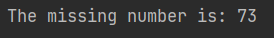
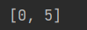
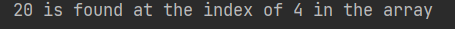

### Array Interview Questions

```
Missing Number
Find the missing number in an intrger array of 1 to 100
```
```java
public class MissingNumber {
    public void missingNumber(int[] array){
        int sum1 = 0;
        int sum2 = 0;
        for (int i : array) {
            sum1 += i;
        }
        sum2 = 100*(100 + 1)/2;
        int result = sum2 - sum1;
        System.out.println("The missing number is: " + result);
    }
```

***
```
Pairs / Two Sum
Write program to find all pairs of integers whose sum is equal to a given number.
```
```java
public class TwoSum {
    public int[] twoSum(int[] nums, int target) {
        for (int i = 0; i < nums.length; i++) {
            for (int j = 0; j < nums.length; j++) {
                if (nums[i] + nums[j] == target) {
                    return new int[]{i, j};
                }
            }
        }
        throw new IllegalArgumentException("Not found!");
    }
}
```
```java
public class Main {
    public static void main(String[] args) {
        TwoSum tSum = new TwoSum();
        int[] array = {2,5,9,4,20,7};
        int[] sum = tSum.twoSum(array,9);
        System.out.println(Arrays.toString(sum));
    }
}
```

***
```
Search for a Value
Write a program to check if an array contains a number in Java
```
```java
public class FindNumber {
    public void findNumber(int[] number, int target) {
        for (int i = 0; i < number.length; i++) {
            if (number[i] == target) {
                System.out.println(target + " is found at the index of " + i + " in the array");
                return;
            }
        }
        System.out.println(target + " is not found!");
    }
}
```

***


