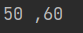
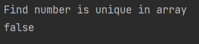
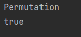
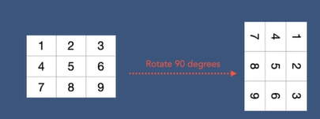
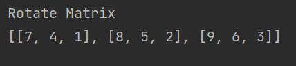

### Array Interview Questions

```
Missing Number
Find the missing number in an intrger array of 1 to 100
```
```java
public class MissingNumber {
    public void missingNumber(int[] array){
        int sum1 = 0;
        int sum2 = 0;
        for (int i : array) {
            sum1 += i;
        }
        sum2 = 100*(100 + 1)/2;
        int result = sum2 - sum1;
        System.out.println("The missing number is: " + result);
    }
```

***
```
Pairs / Two Sum
Write program to find all pairs of integers whose sum is equal to a given number.
```
```java
public class TwoSum {
    public int[] twoSum(int[] nums, int target) {
        for (int i = 0; i < nums.length; i++) {
            for (int j = 0; j < nums.length; j++) {
                if (nums[i] + nums[j] == target) {
                    return new int[]{i, j};
                }
            }
        }
        throw new IllegalArgumentException("Not found!");
    }
}
```
```java
public class Main {
    public static void main(String[] args) {
        TwoSum tSum = new TwoSum();
        int[] array = {2,5,9,4,20,7};
        int[] sum = tSum.twoSum(array,9);
        System.out.println(Arrays.toString(sum));
    }
}
```

***
```
Search for a Value
Write a program to check if an array contains a number in Java
```
```java
public class FindNumber {
    public void findNumber(int[] number, int target) {
        for (int i = 0; i < number.length; i++) {
            if (number[i] == target) {
                System.out.println(target + " is found at the index of " + i + " in the array");
                return;
            }
        }
        System.out.println(target + " is not found!");
    }
}
```

***
```
Max Product of Two Integers
Write a program to find maximum product of two integers in the array where all elements are positive
```
```java
public class MaxProductOfTwoNumbers {
    public String maxProduct(int[] intArray) {
        int maxProduct = 0;
        String pairs = "";
        for (int i = 0; i < intArray.length; i++) {
            for (int j = i + 1; j < intArray.length; j++) {
                if (intArray[i] * intArray[j] > maxProduct) {
                    maxProduct = intArray[i] * intArray[j];
                    pairs = Integer.toString(intArray[i]) + " ," + Integer.toString(intArray[j]);
                }
            }
        }
        return pairs;
    }
}
```
```java
public class Main {
    public static void main(String[] args) {
        MaxProductOfTwoNumbers mProduct = new MaxProductOfTwoNumbers();
        int[] intArray1 = {10, 20, 30, 40, 50, 60};
        String pairs = mProduct.maxProduct(intArray1);
        System.out.println(pairs);
    }
}
```

***
```
Is Unique
Write a program to check if an array is unique or not
```
```java
public class IsUnique {
    public boolean isUnique(int[] array) {
        for (int i = 0; i < array.length; i++) {
            for (int j = i +1; j < array.length ; j++) {
                if (array[i] == array[j]) {
                    return false;
                }
            }
        }
        return true;
    }
}
```
```java
        IsUnique isUniqueNumber = new IsUnique();
        int[] numbers = {10, 20, 30, 40, 10, 50};
        boolean unique =  isUniqueNumber.isUnique(numbers);
        System.out.println((unique));
```

***
```
Permutation
Your are given two integer arrays. Write a program to check if they are permutation of each other.
```
```java
public class Permutation {

    public boolean permutation(int[] array1, int[] array2) {
        if (array1.length != array2.length) {
            return false;
        }
        int sum1 = 0;
        int sum2 = 0;
        int mul1 = 1;
        int mul2 = 1;

        for (int i = 0; i < array1.length; i++) {
            sum1 += array1[i];
            sum2 += array2[i];
            mul1 *= array1[i];
            mul2 *= array2[i];
        }
        if (sum1 == sum2 && mul1 == mul2) {
            return true;
        }
        return false;
    }
}
```
```java
      Permutation permutation = new Permutation();
        int[] array1 = {1, 2, 3, 4, 5, 6};
        int[] array2 = {5, 6, 4, 3, 1, 2};
        boolean permutationArray = permutation.permutation(array1,array2);
        System.out.println(permutationArray);
```

***
```
Rotate Matrix
Given an image represented by an N*N matrix write a method to rotate the image by 90 degress
```


```java
 public class RotateMatrix {
    public boolean rotateMatrix(int[][] matrix) {
        if (matrix.length == 0 || matrix.length != matrix[0].length) return false;
        int n = matrix.length;
        for (int layer = 0; layer < n / 2; layer++) {
            int first = layer;
            int last = n - 1 - layer;
            for (int i = first; i < last; i++) {
                int offset = i - first;
                int top = matrix[first][i];
                matrix[first][i] = matrix[last - offset][first];
                matrix[last - offset][first] = matrix[last][last - offset];
                matrix[last][last - offset] = matrix[i][last];
                matrix[i][last] = top;
            }
        }
        return true;
    }
}
```
```java
RotateMatrix rm = new RotateMatrix();
int[][] matrix = {{1, 2, 3}, {4, 5, 6}, {7, 8, 9}};
rm.rotateMatrix(matrix);
System.out.println(Arrays.deepToString(matrix));
```


***


