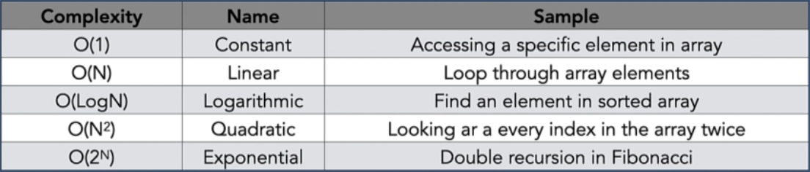
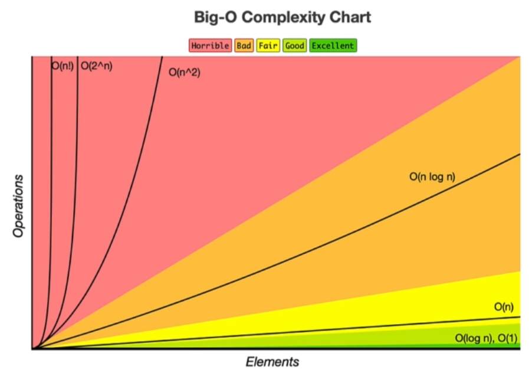
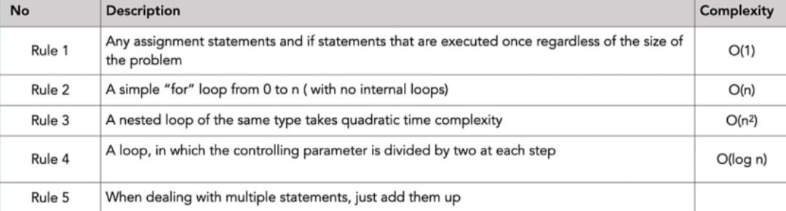

### Runtime Complexities



- O(1) - Constant time
 ```java
int [] array = {1, 2, 3, 4, 5}
array[0] // It takes constant time to access first element
```
***
- O(N) - Linear time
```java
int [] custArray = {1, 2, 3, 4, 5}
for (int i = 0; i < custArray.length; i++) {
    System.out.println(custArray[i]);
        } // linear time since it is visiting every element of the array
```
***

- O(LogN) - Logarithmic time 
- such as: Binary search
```java
int [] custArray = {1, 2, 3, 4, 5}
for (int i = 0; i < custArray.length; i+3) {
    System.out.println(custArray[i]);
        } // logarithmic time since it is visiting some elements
```
***
- O(N2) - Quadratic time
```java
int [] custArray = {1, 2, 3, 4, 5}
for (int i = 0; i < custArray.length; i++) {
    for (int j = 0; j < custArray.length; j++) {
        System.out.println(custArray[i]);
    }
} // linear time since it is visiting every element of the array
```

*** 
- O(2N) - Exponential time
```java
    public long fibonacci(int n) {
        if (n == 0 || n == 1) {
            return n;
        }
        return  (fibonacci(n-1) + fibonacci(n-2));
    }
```



***

### How to measure the codes using Big O?

