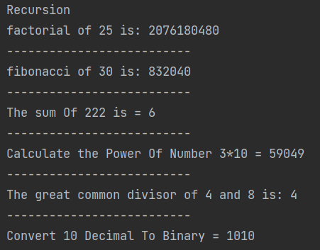

# Java Data Structures & Algorithms


```java
public class Factorial {
    public int factorial(int n) {
        if (n<1) {
            return -1;
        }
        if (n <= 1) {
            return 1;
        }
        return n * factorial(n-1);
    }
}
```
###### Fibonacci
```java
public class Fibonacci {
    public long fibonacci(int n) {
        if (n<0) {
            return -1;
        }
        if (n <= 1) {
            return n;
        }
        return  (fibonacci(n-1) + fibonacci(n-2));
    }    
}
```
```java
public class SumOfNumbers {
    public int sumOfNumbers(int n) {
        // Base case
        if (n <= 0) {
            return 0;
        }
        return  n%10 + sumOfNumbers(n/10);
    }
}
```
```java
public class CalculatePowerOfNumber {
    public int calculatePowerOfNumber(int base, int exp) {
        // positive number only
        if (exp < 0) {
            return -1;
        }
        // Base case
        if (exp == 0 || exp == 1) {
            return base;
        }
        return base * calculatePowerOfNumber(base ,exp-1);
    }
}
```

```java
public class GreatestCommonDivisor {
    public int gcd(int a, int b) {
        // positive number only
        if (b < 0 || a < 0){
            return -1;
        }
        // Base case
        if (b == 0) {
            return a;
        }
        return gcd(b,a%b);
    }
}
```

```java
public class ConvertDecimalToBinary {
    public int decimalToBinary(int n) {
        // Base case
        if (n == 0) {
            return 0;
        }
        return ((n %2) + (10 * decimalToBinary(n /2)));
    }
}
```

